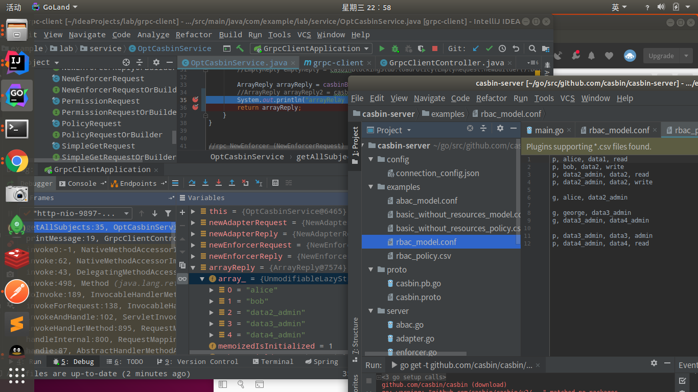
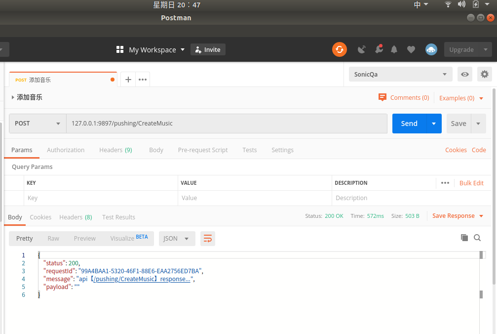
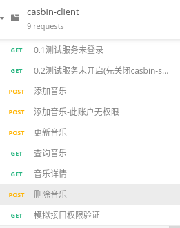

# spring-boot-grpc-client-with-casbin-server
```text
Spring-Boot integrates GRPC to implement GRPC client and communicate with casbin-server GRPC server
```    
## IDEA config project


## Built-in strategy
- casbin-server default built-in policy interface data


   
## casbin-server customize the built-in policy interface data            


  
## Permission validation PostMan tests

### data preparation
- model
```text
[request_definition]
r = sub, obj, act

[policy_definition]
p = sub, obj, act, eft

[policy_effect]
e = some(where (p.eft == allow)) && !some(where (p.eft == deny))

[matchers]
m = r.sub == p.sub && keyMatch(r.obj, p.obj) && keyMatch(r.act, p.act)
```
- policy
```text
p, cjc, acrn:smc:pushing:*:vod:ListMusics, pushing:ListMusics, allow
p, cjc, acrn:smc:pushing:*:vod:DescribeMusic, pushing:DescribeMusic, allow
p, cjc, acrn:smc:pushing:*:vod:CreateMusic, pushing:CreateMusic, allow
p, cjc, acrn:smc:pushing:*:vod:UpdateMusic, pushing:UpdateMusic, allow
p, cjc, acrn:smc:pushing:*:vod:DeleteMusic, pushing:UpdateMusic, allow

p, zym, acrn:smc:pushing:*:vod:ListMusics, pushing:ListMusics, allow
p, zym, acrn:smc:pushing:*:vod:DescribeMusic, pushing:DescribeMusic, allow

p, je, acrn:smc:pushing:*:vod:DescribeMusic, pushing:DescribeMusic, allow

p, david, *, *, allow

p, alice, *, List*, allow
```

### The test case
-  1.Unlogged state
 
   
- 2.Casbin-server is not enabled (when server is enabled,client can access server directly without restarting)
 
 
- 3.1. CreateMusic
 
   
- 3.2. No execution permission
   
 
- 4.UpdateMusic
 
 
- 5.ListMusics
   
 
- 6.DescribeMusic
 
 
- 7.DeleteMusic
 
 
## Remark
```text
The PostMan interface test data is in the PostMan folder(casbin-client.postman_collection.json)
```  
  